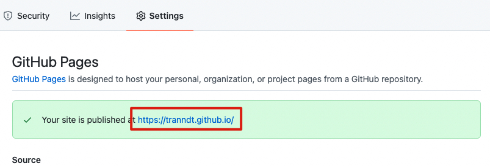

# How To Host A Resume on GitHub Pages

## Prerequisites

- **Have a resume ready in Markdown.**
  - There are many Mardown flavors to choose from, but the most popular are [GitHub Flavored Markdown](https://github.github.com/gfm/) and [CommonMark](https://spec.commonmark.org/0.28/).
- Have a Code Editor.
  - Some popular code editors are [Atom](https://atom.io/) and [Microsoft VS Code](https://code.visualstudio.com/).
- Install Jekyll (see ["Jekyll Docs site"](https://jekyllrb.com/docs/)). You might have to install Ruby (see ["Installing Ruby"](https://www.ruby-lang.org/en/documentation/installation/)) and Bundler (see ["Bundler"](https://bundler.io/)) first

## Instructions

### Initializing repository

- Create a Public repository named as **ACCOUNT-NAME.github.io**. Replace ACCOUNT-NAME with your GitHub account name
- Create a branch called gh-pages
- Clone the project and checkout the gh-pages branch
- Upload your resume to the repo as index.md
- Push the changes to the repository

### Hosting your resume on GitHub

- Go to Settings > Pages on the online GitHub repository.

- To see your published resume, under "GitHub Pages", click your site's URL.

- Alternatively, you can choose a Theme for your resume for extra style.

## More resources

## Authors and Acknowledgements

## FAQs
