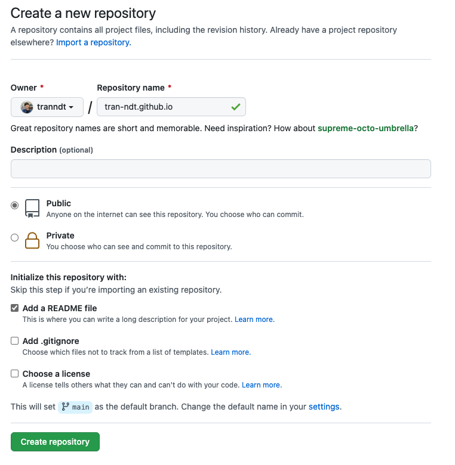

# How To Host A Resume on GitHub Pages

## Purpose

The purpose of this tutorial is to guide users on how to host a resume online using Markdown and GitHub Pages.

## Prerequisites

You will need:

- **A resume written in Markdown.**
  - Mardown (.md) is a lightweight Markup Language that is very widely used in documentation. 

  - There are many Mardown flavors (styles) to choose from, such as [GitHub Flavored Markdown](https://github.github.com/gfm/) or [CommonMark](https://spec.commonmark.org/0.28/). GitHub Flavored Markdown is a popular and fine choice for simple pages, such as the resume we are trying to host. ([Andrew Etter](#more-resources))

  - Resources for learning Markdown can be found under [More Resources](#more-resources)

- **A code editor**
  - This will be used to edit your resume source files (e.g. writing the resume in Markdown, changing Jekyll front matters, etc.). Some popular choices for code editors are [Atom](https://atom.io/) and [Microsoft VS Code](https://code.visualstudio.com/).

  - Alternatively, [HackMD](https://hackmd.io/) is a free online Markdown editor that also allows you to create a markdown document.

## Instructions

### 1. Initialize a GitHub repository for your source files

- In your Github main page ([github.com](github.com)), on the **Repositories** sidebar and click **New**


- Name your repository as **ACCOUNT-NAME.github.io**. Replace ACCOUNT-NAME with your GitHub account name. Optionally, you can choose to **Add a README file**


### 2. Upload your Markdown resume

- First, rename your Markdown resume as ```index.md```. This will allow GitHub Pages to recognize that this is the file you want to host
- In your GitHub, click **Upload file**, and select the file from its local location.
- Click **Commit changes**

### 3. Set up your GitHub Pages site

- Go to Settings > Pages on your GitHub.
- Choose a Theme (optional)
- Click on the URL under GitHub Pages to view your site

## More resources

- [Markdown Tutorial](https://www.markdowntutorial.com/)
- [Basic Markdown Syntax by markdownguide.org](https://www.markdownguide.org/basic-syntax/)
- [Andrew Etter's Modern Technical Writing](https://www.amazon.ca/Modern-Technical-Writing-Introduction-Documentation-ebook/dp/B01A2QL9SS)

## Authors and Acknowledgements

The author of this tutorial is [Jason Tran](https://github.com/tranndt), with special acknowledgement to [Andrew Etter and his book "Modern Technical Writing \<An Introduction to Software Documentation\>"](#more-resources)

## FAQs

### 1. Why is Markdown better than a Word Processor?

- Word documents are great for resume, but they are horrible for documentation. They lack the online support such as HTML export features, which make them unsustainable for hosting on a website. Users also have to format it directly on Word, with no choice for separation (such as HTML, CSS, JS). Finally Word is a paid product, and is only available on Windows and macOS. ([Andrew Etter](#more-resources))

- Markdown, on the other hand, is the most used lightweight Markup Language. The advantages of Markdown formatting are that it is generally easier to read and make changes, and contains much less formatting. It is also free, and acessible to all users. Because of this simplicity and accessibility, it can also be integrated to web environment much easier than .DOCX documents. ([Andrew Etter](#more-resources))

### 2. Why can't I see the URL in my Pages settings? 

- This likely happens because GitHub Pages does not recognize that you want to use this repository to host a page. To explicitly signal your intention, create a new branch in your repository named ```gh-pages```. Follow the similar steps and push your resume to the ```gh-pages``` branch and it should work.
